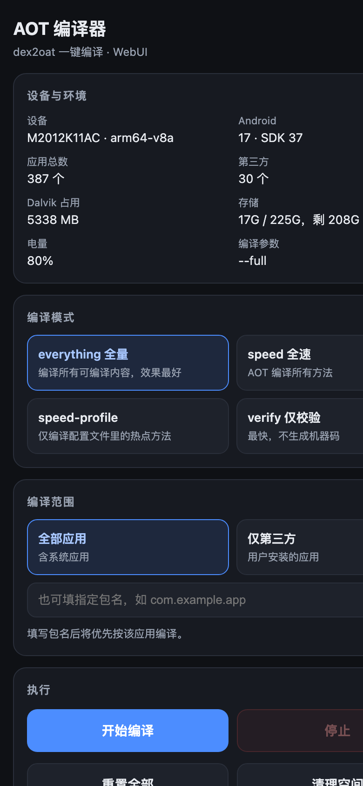
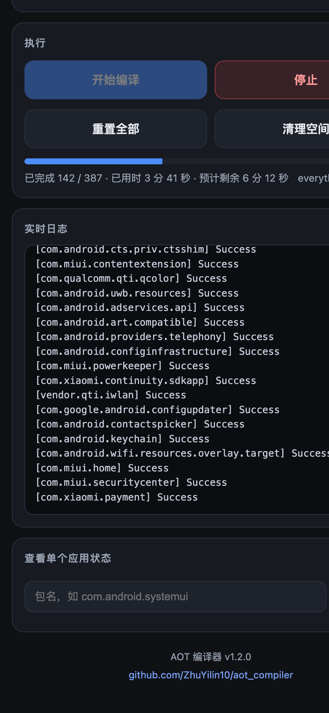
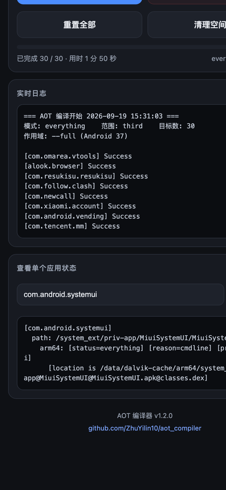

# AOT 编译器

**一键给安卓应用做 dex2oat AOT 编译的 KernelSU / Magisk 模块，自带 WebUI。**

刷机、恢复出厂、换机之后，应用其实都处于「没编译」状态，所以用起来发涩。这个模块就是把系统自带的 dex2oat 全量编译能力做成一个开关：点一下，把常用应用全部预先编译成机器码。

不需要电脑、不需要敲命令，编译过程脱离界面独立运行，关掉页面或拔线都不会中断。

[](LICENSE)
[](https://github.com/ZhuYilin10/aot_compiler/releases)
[](#环境要求)
[](https://kernelsu.org)
[](https://github.com/ZhuYilin10/aot_compiler/releases)

---

## 下载

| 方式 | 链接 |
|---|---|
| **最新版（推荐）** | [Releases · latest](https://github.com/ZhuYilin10/aot_compiler/releases/latest) |
| 直接下载 zip | [`aot_compiler-v1.2.0.zip`](https://github.com/ZhuYilin10/aot_compiler/releases/download/v1.2.0/aot_compiler-v1.2.0.zip) |
| 仓库内副本 | [`download/aot_compiler-v1.2.0.zip`](download/aot_compiler-v1.2.0.zip) |
| 源码 | `git clone https://github.com/ZhuYilin10/aot_compiler.git` |

模块内已配置 `updateJson`，装好后在管理器里能直接检测到新版本。

## 界面预览

| 主界面 | 编译中 | 单应用查询 |
|---|---|---|
|  |  |  |

---

## 为什么做这个

**1. 刷完机，应用其实没被编译过**

Android 从 9 开始，默认只在安装时做 `speed-profile`（只编译配置文件里的热点方法），其余靠 JIT 运行时补。而刷机、恢复出厂之后，`pm.dexopt.first-boot` 在很多 ROM 上被设成 `verify` —— 也就是**只校验语法，一行机器码都不生成**。

结果就是：系统是新的，但每个应用第一次打开都要现场解释执行 + 预热 JIT，又慢又费电。

**2. 官方的自动优化太"佛系"**

系统有个后台任务 `bg-dexopt`（BackgroundDexOptService），只会在**设备空闲 + 充电**时慢慢跑，而且用的是 `speed-profile`——只编热点。想等它把几百个应用都优化好，基本是随缘。

**3. 系统设置里没有入口**

全量编译的唯一官方途径是 adb 命令：

```sh
adb shell cmd package compile -m everything -f --full -a
```

普通用户根本接触不到，而且 Android 14 前后命令参数还不一样。

**4. 现成工具在新系统上不好用了**

这类工具里最有名的是 Scene。实测它的 dex2oat 功能：虽然是支持 `everything` 模式的，但

- 只能**逐个应用**点选编译，没有真正的一键全量
- 下发的命令**缺少 `--full`**，在 Android 14+ 上只编主 dex，副 dex 完全不编，效果大打折扣
- `targetSdk` 停留在 30，在新系统上受各种后台限制
- 有「该功能暂不支持您的设备」的版本门槛

**所以就有了这个模块**：把官方命令包成一键操作，自动适配新旧 Android，把进度、日志、取消、清理都做进界面，并且让编译进程独立于界面运行。

---

## 原理

### 应用是怎么被执行的

Android 应用的代码以 **DEX 字节码**形式存在于 APK 中。真正执行这些代码的是 **ART**（Android Runtime），它有三种执行方式：

| 方式 | 说明 | 速度 |
|---|---|---|
| 解释执行 | 逐条翻译字节码 | 最慢 |
| **JIT** | 运行时把热点方法编译成机器码 | 中等，且消耗运行时的 CPU |
| **AOT** | 提前把字节码编译成机器码 | 最快（省掉编译开销） |

理想状态是「AOT 覆盖得越多越好」——但全量 AOT 需要时间和存储空间，所以 Android 一直在「编译多少」和「省空间/省时间」之间做权衡。

### dex2oat 与编译过滤器

`dex2oat` 就是执行 DEX → 机器码翻译的工具。它能编译多少，由**编译过滤器（compiler filter）**决定：

| 过滤器 | 含义 |
|---|---|
| `verify` | 只做校验，不生成机器码 |
| `speed-profile` | 只编译 profile 里记录的热点方法 |
| `speed` | 编译全部方法 |
| `everything` | 连通常被跳过的方法也一起编，最彻底 |

编译产物写入 `/data/dalvik-cache/<架构>/`，例如：

```
/data/dalvik-cache/arm64/system_ext@priv-app@MiuiSystemUI@MiuiSystemUI.apk@classes.dex
/data/dalvik-cache/arm64/system_ext@priv-app@MiuiSystemUI@MiuiSystemUI.apk@classes.vdex
```

产物是**持久保存**的，重启后依然有效；但系统 OTA 或手动清 dalvik-cache 会清掉，需要重跑。

### 命令链路

这个模块并不自己实现编译，而是调用系统官方的接口：

```
cmd package compile -m <filter> -f --full -a
        │
        ▼
PackageManagerShellCommand
        │
        ▼
ArtManagerLocal  ──►  ArtService  ──►  dex2oat
```

Android 14 起额外提供了 `pm art` 子命令（ArtManagerLocal 的 shell 入口），模块用到其中三个：

| 命令 | 用途 |
|---|---|
| `pm art dump` | 查看每个应用当前的编译状态（用于「单应用查询」） |
| `pm art cancel` | 取消还在排队的 dexopt 作业（用于「停止」） |
| `pm art cleanup` | 清理无用的 odex/vdex（用于「清理空间」） |

### 为什么要区分 `--full`

- **Android 14 (SDK 34) 及以上**：有作用域参数，`--full` 表示「主 dex + 副 dex + 依赖」
- **Android 13 及以下**：没有 `--full`，只能先跑一遍默认作用域（主 dex + 依赖），再单独跑一遍 `--secondary-dex` 补副 dex

模块会按 SDK 自动选择，见下节。

### 编译进程为什么不会被打断

编译由后台脚本驱动，启动时用 `setsid`（拿不到就退回 `nohup`）脱离调用方会话，stdout/stderr 全部重定向到日志文件。所以：

- 关掉 WebUI → 编译继续
- 拔掉数据线 → 编译继续
- 重新打开 WebUI → 接着看进度

---

## 特性

- **四种编译模式**：`everything` 全量 / `speed` / `speed-profile` / `verify`
- **三种编译范围**：全部应用 / 仅第三方应用 / 指定包名
- **一键操作**：开始编译、停止（含取消系统侧作业）、重置全部、清理空间
- **实时反馈**：进度条、完成数、已用时、**预计剩余时间**、实时日志
- **单应用查询**：看某个应用实际用的是哪个编译过滤器
- **自动适配**：见下表

### 自动适配

| 项目 | 处理方式 |
|---|---|
| Android 版本 | SDK ≥ 34 用 `--full`；SDK < 34 用默认作用域 + `--secondary-dex` |
| CPU 架构 | 自动探测 `arm64 / arm / x86_64 / x86 / riscv64` 的 dalvik 路径，并带兜底遍历 |
| `pm art` 子命令 | 按 SDK 判断，低版本优雅跳过，不报错 |
| `everything` 被拒 | 先用小包探测，被拒则**自动降级为 `speed`** 并在界面提示 |
| 模块 id 变更 | WebUI 通过管理器返回的模块信息动态定位脚本，改名不会失效 |
| 应用列表 | 优先 `cmd package list packages`，回退 `pm list packages` |
| 进程存活 | `setsid` → `nohup` 逐级回退 |

> `everything` 是否允许由各 ROM 决定。小米 HyperOS 放开了；部分严格的 user 构建会拒绝，此时会自动降级，不会白跑。

## 环境要求

- **Root**：KernelSU / KernelSU-Next / ReSukiSU / APatch 等
- **WebUI**：需要支持模块 WebUI 的管理器（KernelSU 系）。
  ⚠️ **Magisk 没有模块 WebUI**，只能通过终端执行命令，见 [命令行用法](#命令行用法)
- Android 7.0 (API 24) 及以上

### 已验证环境

| 设备 | 系统 | Root | 结果 |
|---|---|---|---|
| Redmi K40 (`alioth`) | OS4.0.0.30.XPCCNXM / Android 17 (SDK 37) | ReSukiSU 4.2.0 | 全部功能通过 |

其他机型欢迎按 [贡献](#贡献) 里的模板反馈。

---

## 刷写方法

### 方式一：KernelSU 系管理器（推荐，有 WebUI）

适用于 **KernelSU / KernelSU-Next / ReSukiSU / APatch** 等。

1. 下载 `aot_compiler-vX.Y.Z.zip`（见 [下载](#下载)）
2. 打开管理器 → **模块**
3. 点 **从本地安装 / Install from storage**，选择刚下载的 zip
4. 安装完成后 **重启手机**（首次安装模块必须重启才会激活）
5. 重启后重新进入 管理器 → 模块，找到 **AOT 编译器**
6. 点模块右侧的 **WebUI** 图标即可打开界面

### 方式二：命令行安装（通用）

不依赖管理器界面，适用于所有支持 KernelSU 模块的环境：

```sh
adb push aot_compiler-v1.2.0.zip /data/local/tmp/
adb shell su -c 'ksud module install /data/local/tmp/aot_compiler-v1.2.0.zip'
adb reboot
```

重启后验证是否激活：

```sh
adb shell su -c 'ksud module list'
# 出现 "id": "aot_compiler" 且 "web": "true" 即为正常
```

### 方式三：Magisk（无 WebUI，仅命令行）

1. Magisk → **模块** → **从本地安装** → 选择 zip → 重启
2. 因为 Magisk 没有模块 WebUI，只能通过终端调用脚本（见 [命令行用法](#命令行用法)）

### 升级

直接安装新版本 zip，然后重启即可，编译产物和设置不受影响。

### 卸载

- 管理器里删除该模块，重启
- 或 `adb shell su -c 'ksud module uninstall aot_compiler'`，重启

编译产物不会随模块删除，如需一并清除，先点界面上的 **重置全部**。

---

## 使用方法

### 界面操作

**第一步 · 选编译模式**


顶部「设备与环境」会显示机型、架构、Android 版本、应用总数、dalvik 占用、存储和电量。

下面是四种模式，默认 `everything 全量`：

| 模式 | 含义 | 耗时 | 存储占用 |
|---|---|---|---|
| `everything` | 编译所有可编译内容，效果最好 | 最长 | 最大（可能数 GB） |
| `speed` | AOT 编译所有方法 | 较长 | 较大 |
| `speed-profile` | 只编 profile 中的热点方法 | 短 | 小 |
| `verify` | 仅校验，不生成机器码 | 最短 | 最小 |

**第二步 · 选编译范围**

- **全部应用**：含系统应用（几百个，`everything` 全量约 10 分钟）
- **仅第三方**：只编译你自己装的
- **指定包名**：在输入框填包名，会优先只编这一个

**第三步 · 开始编译**


点 **开始编译**。全量模式会有二次确认。运行中可以看到：

- 进度条与 `已完成 142 / 387`
- 已用时与**预计剩余时间**
- 实时滚动的日志

> 首次使用建议先跑一次 **仅第三方 + verify**，几十秒就能完成，确认没问题再跑全量。

**第四步 · 完成后可以查询**


在「查看单个应用状态」里填包名，可以看到它实际用的过滤器：

```
[com.android.systemui]
  path: /system_ext/priv-app/MiuiSystemUI/MiuiSystemUI.apk
    arm64: [status=everything] [reason=cmdline] [primary-abi]
```

其他按钮：

- **停止**：终止任务，并请求取消系统侧还在排队的 dexopt 作业（正在跑的那一个可能还会收尾）
- **重置全部**：清除全部 dexopt 产物，等于回到「刚安装」状态
- **清理空间**：执行 `pm art cleanup`，释放无用的 odex/vdex

### 命令行用法

不打开 WebUI 也能用：

```sh
su -c 'sh /data/adb/modules/aot_compiler/bin/aot.sh status'
su -c 'sh /data/adb/modules/aot_compiler/bin/aot.sh start everything third'
su -c 'sh /data/adb/modules/aot_compiler/bin/aot.sh stop'
```

| 子命令 | 说明 |
|---|---|
| `start <filter> <scope>` | `filter`: everything / speed / speed-profile / verify；`scope`: `all` / `third` / 包名 |
| `stop` | 停止任务并取消作业 |
| `status` | 状态键值对（`state/filter/scope/total/done/eta/note`） |
| `log [n]` | 日志尾部 n 行（默认 300） |
| `reset` | 重置全部应用 dexopt 状态 |
| `cleanup` | 清理无用 odex/vdex |
| `query <包名>` | 查询单个应用编译状态 |
| `info` | 设备与环境信息 |
| `version` | 版本号 |

运行时文件位于 `/data/local/tmp/aot_compiler/`。

---

## 常见问题

**Q：编译要多久？**
取决于应用数量和模式。K40 实测：387 个应用跑 `everything` 约 10 分钟，30 个第三方应用约 2 分钟。界面会给出预计剩余时间。

**Q：会清数据吗？**
不会。只生成/替换 dalvik-cache 里的编译产物，不动任何用户数据。

**Q：跑完占多少空间？**
`everything` 全量通常增加数 GB。界面「Dalvik 占用」可以直接看到变化。空间紧张就点「清理空间」或改用 `speed-profile`。

**Q：重启后还有效吗？**
有效，产物持久保存。但**系统 OTA 更新或清 dalvik-cache 会失效**，重跑一次即可。

**Q：为什么 `everything` 自动变成 `speed` 了？**
你的 ROM 不允许 `everything` 过滤器，脚本自动降级并在界面顶部提示，属正常行为。

**Q：编译时手机发烫 / 卡顿正常吗？**
正常。dex2oat 会吃满 CPU，建议插着电跑，跑完就恢复。

**Q：能关掉界面吗？**
可以，编译在后台独立运行，重新打开 WebUI 会接着显示进度。但**别在编译时重启手机**。

**Q：系统升级后要重跑吗？**
建议重跑。OTA 会重建 dalvik-cache。

---

## 项目结构

```
.
├── module.prop              # 模块信息（含 updateJson）
├── customize.sh             # 安装脚本，打印设备环境与将使用的作用域
├── bin/aot.sh               # 核心：dex2oat 编译后端
├── webroot/index.html       # WebUI 界面
├── build.sh                 # 本地打包
├── update.json              # 模块更新检查
├── screenshots/             # README 用图
├── download/                # 打包好的 zip 副本
└── .github/workflows/
    └── release.yml          # 打 tag 自动构建并发布 Release
```

## 开发与构建

```sh
./build.sh              # 打包到 dist/，并同步一份到 download/
./build.sh --dist-only  # 只打包到 dist/
```

本地验证脚本（需要有 root 的设备）：

```sh
adb push bin/aot.sh /data/local/tmp/aot.sh
adb shell su -c 'chmod 755 /data/local/tmp/aot.sh; AOT_BASE=/data/local/tmp/aot_test /data/local/tmp/aot.sh info'
```

`AOT_BASE` 环境变量可以覆盖运行时目录，方便隔离测试。

### 发布流程

1. 修改 `module.prop` 的 `version` / `versionCode`
2. 更新 `CHANGELOG.md`
3. 更新 `update.json` 的 `version` / `versionCode` / `zipUrl`
4. 打 tag 并推送：

```sh
git tag vX.Y.Z && git push origin vX.Y.Z
```

GitHub Actions 会自动打包并创建对应的 Release。

## 贡献

欢迎提交 Issue 和 PR。反馈机型兼容性时，请附上：

- 机型、ROM 名称与版本、Android 版本 / SDK
- Root 方案与版本（KernelSU / KernelSU-Next / ReSukiSU / APatch / Magisk …）
- 报错内容或 WebUI 截图

## 免责声明

本模块只是调用系统自带的 dex2oat 接口，不会修改系统分区，也不会清除数据。但任何对设备底层的操作都存在风险，请自行评估。作者不对任何设备损坏或数据丢失负责。

## 许可证

[MIT](LICENSE)
